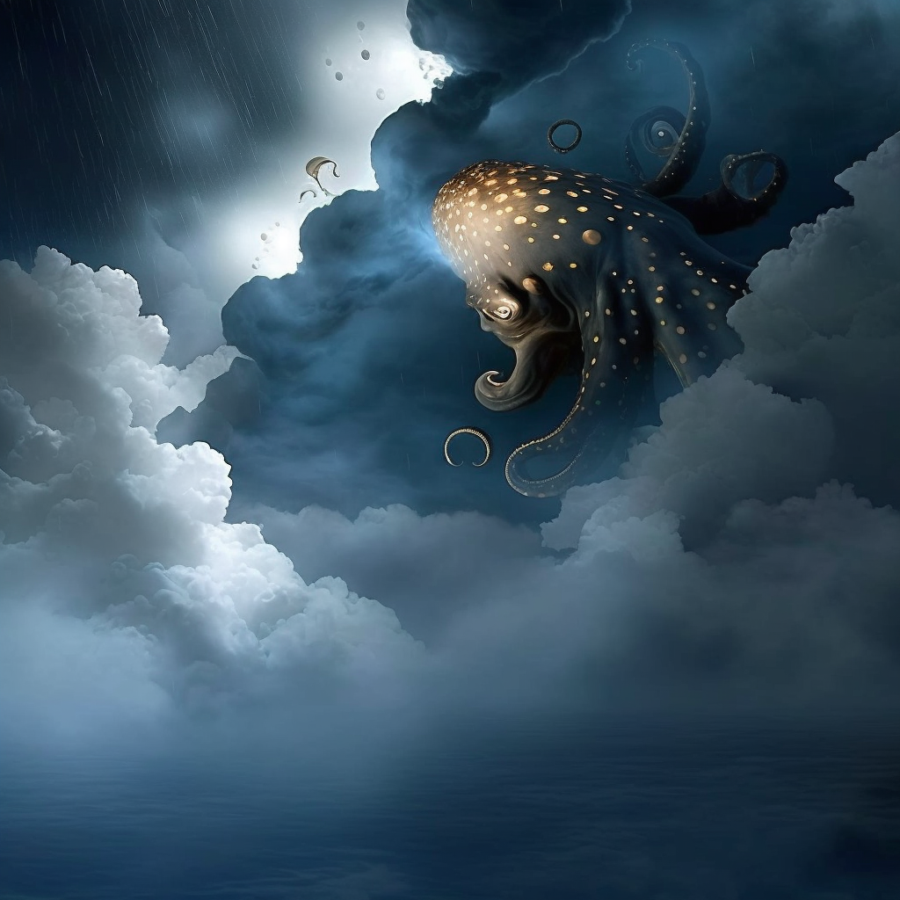
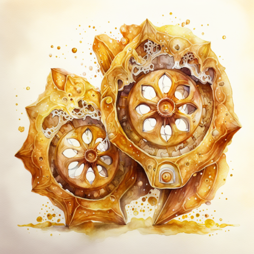
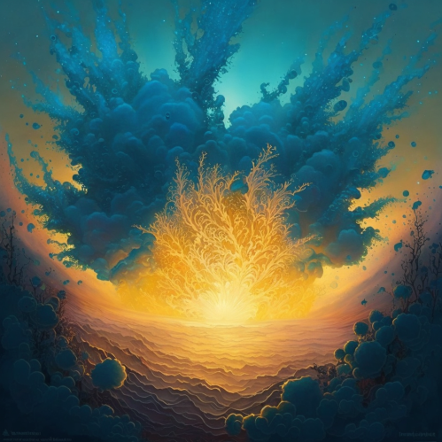

# Por entre corrientes doradas

<!--A Pechi 🐚༄ -->

Dos siluetas son las que caminan. Una lleva sombrero, la otra un bolso de algas
tejidas. Sus pies descalzos dejan tenues huellas en el manto de hojas.

{ width="200" align=left }
-- "Quizás debí hacerte caso y traer el quinqué en lugar de esto. Había
entonces un brillante sol. ¿Cómo lo iba a saber yo? En un momento se tornó de
tinta. Es el cielo un calamar tan miedoso."

{ width="150" align=right }
-- "Tal vez, pero entonces no podrías haberme prestado tu sombrero. Para
cubrirme el rostro, para dormir apacible en aquel prado. Toma, llevo guardadas
varias hogazas todavía. Siguen crujientes y aún les giran sus manecillas."

-- "¿Fue feliz tu sueño? Se me hace tan largo, es ya indistinto dormir de día o
andar de noche. ¿Pudiste ver el fin de nuestro andar? Al menos las luciérnagas
nadan fielmente a nuestro lado. Gracias ... por el tiempo."

{ width="200" align=left }
Imponentes torres los rodean, fumarolas marinas de cuyas humeantes volutas caen
apacibles hojas. Hambre no es lo que tenía, ni siquiera real cansancio. Tan
sólo la incertidumbre de si algún día llegarían. Saboreó el momento. Era su
preferido, tenía pasas. Estaba endulzado con miel y había sido horneado a fuego
lento. Alzó la mirada, miró a su costado. Tan oceánico abismo podía ser la
noche.

-- "Creo que olvidé el sueño. Pero era feliz pues mirábamos al unísono. Oh, era
a través de la claraboya de un navío naufragado, que hacia el horizonte
dirigíamos la mirada. A lo lejos un brillante recuerdo nos llamaba. Pero, no
recuerdo más. ¿Acaso guardabas el vaivén de un péndulo en mi bolso?"

-- "Si tan sólo pudiesemos regresar a la cabaña. Hornearíamos más de éstos y
tendríamos con qué iluminar nuestro paso. Tendríamos con qué espantar este
cobijo tan oscuro. Seríamos una relumbrante estrella, ignorante de las olas
sobre nuestras cabezas. Quisiera ya llegar."

-- "¿Pero no ves que la vigilia no sería más que este dormir? Si hemos de
cruzar que sea a paso quedo. Hollando la memoria con nuestro andar. Alimentando
la esperanza con nuestras huellas. ¿No ves que tu dorado sombrero sostiene el
rocío?"

Tanto han caminado que la luna está ahora a sus espaldas y una cornalina tienen
entre sus manos.
