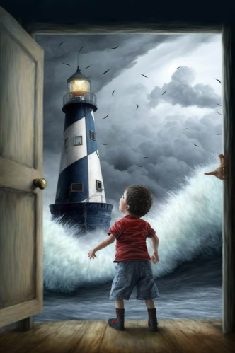

# Sala con alfombra azul

{ width=350 align=right }
¿Puede
alguien imaginar la tentación de un niño? Que observa la cartulina teniendo en
su mano una cajita de crayolas nuevas. Su mamá no se había molestado en tirar
aún el aparatoso envoltorio de la nueva nevera. Bastó con que sus manitas la
arrastrasen hasta el centro de la sala para quedar convertida en torre de
castillo. Dibujó algunos ladrillos grises, el rojo sería para las banderas. El
marrón de la caja sonrió complice a la crayola blanca, siempre menospreciada, y
dejó que en su pared grabase un par de blasones. El niño lo pensó un momento y
convirtió a la alfombra en marea. Lo volvió a pensar, ¿un castillo sobre el
mar? Mejor un faro portentoso, que con su luz desafiase al eclipse perpetuo. Un
alargado monstruo nadaba en derredor, siendo su destino el sofocar todo intento
de hallar el cofre bajo el faro. Los sofás ya no eran sino peñascos desde los
que el capitán blandía su espada con valentía. ¿Puede alguien imaginar la
soñadora sonrisa que su madre le dirigía de lejos?
