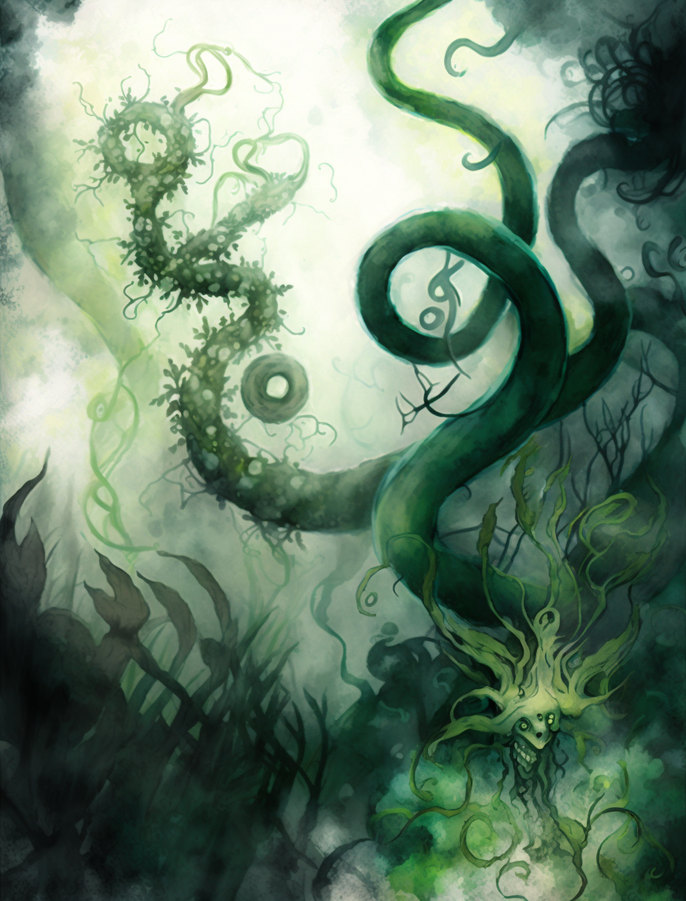
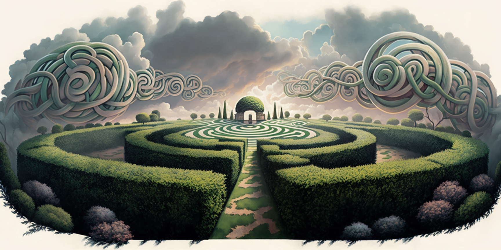

# Camino de setos

<em>A Shakti</em>

Sintiendo
cómo el aire se escurría por entre las hojas, escabulléndose en aquellos
corredores verdes, caminaba ella y pensaba en lo feliz de estar bajo la sombra
de una nube en día soleado. ¿Cuánto tiempo caminando? "*Eso es algo que ya no
sé*", pensó para sus adentros. Observó la rebelión del cirro, que extendía sus
alas y se libraba de las cadenas, de la torre de su encierro. Y los cúmulos de
cruzados níveos tratando de regresarlo al nadir. Nubes belicosas, enfrascadas
en su celeste juego.

{ align=right width=190}
Al bajar los ojos, mira las paredes de imperiosos setos que la rodeaban. Pensó
para si: "*¿Quién sino un enano podría correr por entre sus raíces?*" El camino
que la confundía en sus remolinos de sin salidas, de puentes, pasadizos y todos
verdes. El jardinero maestro, quien había puesto en cada esquina árboles de
cuyas ramas pendían manzanas para alimentar al caminante confundido, era un
hombrecito diminuto. Corría sigiloso por entre el entramado vegetal, cuidando
su precioso jardín. Velando porque ni una sola caléndula feneciese sin razón.
Mientras ella se sentaba en flor de loto y alisaba su falda plisada, a lo lejos
él perfumaba su andar con su puro de mariguana. ¿Tendría confines este paraíso
que la aprisionaba con sus brazos esmeralda? "No, brazos no, son tentáculos"
dijo en voz queda.

El humo se unía al viento en sus andares por entre las hojas, decorando con
pétalos la tela de su regazo. Al hallarla en uno de los callejones, el grisáceo
humo la rodeó, se irguió formando con sus volutas un rostro y una barba. Ella
observaba el cielo, no estaba dormida aún. En lo alto, las nubes seguían su
disputa pero ya no era el sol el que brillaba, sino un relámpago el que cruzó
la bóveda celeste. La niebla subía, era el humo que todo lo cubría. Resistiendo
por otro momento aquello que nublaba su vista creyó recordarlo: "*¿Será mi
nombre Blancanieves?*". Una fría gota cayó desde lo alto hasta su frente y su
alma elevó el vuelo.

